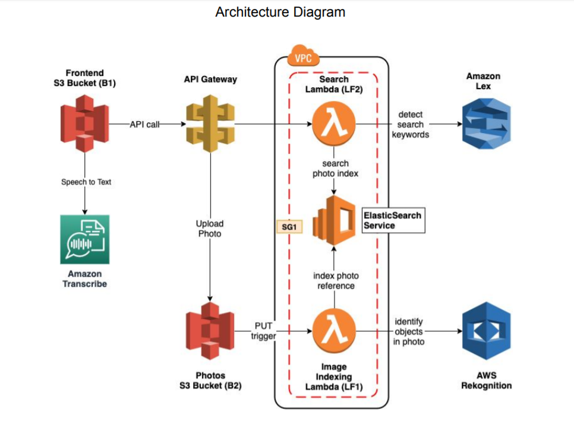

# NLP-Text-Voice-Controlled-Photo-Album
Photo album web application that can be searched using natural language through both text and voice.<br/>
This application uses Lex, ElasticSearch, and Rekognition to create an intelligent search layer to query your photos for people, objects, actions, landmarks and more.


## Steps:
There are 5 components:

### 1.	Launch an ElasticSearch instance 

#### a.	Using AWS ElasticSearch service , create a new domain called “photos”.<br/>

#### b.	Make note of the Security Group (SG1) you attach to the domain.<br/>

#### c.	Deploy the service inside a VPC. This prevents unauthorized internet access to your service.<br/>

### 2.	Upload & index photos

#### a.	Create a S3 bucket (B2) to store the photos.<br/>

#### b.	Create a Lambda function (LF1) called “index-photos”.<br/>
i.	Launch the Lambda function inside the same VPC as ElasticSearch. This ensures that the function can reach the ElasticSearch instance.<br/>
ii.	Make sure the Lambda has the same Security Group (SG1) as ElasticSearch.<br/>

#### c.	Set up a PUT event trigger  on the photos S3 bucket (B2), such that whenever a photo gets uploaded to the bucket, it triggers the Lambda function (LF1) to index it.<br/>
i.	To test this functionality, upload a file to the photos S3 bucket (B2) and check the logs of the indexing Lambda function (LF1) to see if it got invoked. If it did, your setup is complete.<br/>
* If the Lambda (LF1) did not get invoked, check to see if you set up the correct permissions  for S3 to invoke your Lambda function.<br/>

#### d.	Implement the indexing Lambda function (LF1):<br/>
i.	Given a S3 PUT event (E1) detect labels in the image, using Rekognition  (“detectLabels” method).<br/>
ii.	Store a JSON object in an ElasticSearch index (“photos”) that references the S3 object from the PUT event (E1) and an array of string labels, one for each label detected by Rekognition.<br/>
<br/>
Use the following schema for the JSON object:<br/>

```
{
	“objectKey”: “my-photo.jpg”,
	“bucket”: “my-photo-bucket”,
	“createdTimestamp”: “2018-11-05T12:40:02”,
	“labels”: [
		“person”,
		“dog”,
		“ball”,
		“park”
	]
}
```

### 3.	Search

#### a.	Create a Lambda function (LF2) called “search-photos”.
i.	Launch the Lambda function inside the same VPC as ElasticSearch. This ensures that the function can reach the ElasticSearch instance.<br/>
ii.	Make sure the Lambda has the same Security Group (SG1) as ElasticSearch.<br/>

#### b.	Create an Amazon Lex bot to handle search queries.
i.	Create one intent named “SearchIntent”.<br/>
ii.	Add training utterances to the intent, such that the bot can pick up both keyword searches (“trees”, “birds”), as well as sentence searches (“show me trees”, “show me photos with trees and birds in them”).<br/>
* You should be able to handle at least one or two keywords per query.<br/>

#### c.	Implement the Search Lambda function (LF2):
i.	Given a search query “q”, disambiguate the query using the Amazon Lex bot.<br/>
ii.	If the Lex disambiguation request yields any keywords (K1, …, Kn), search the “photos” ElasticSearch index for results, and return them accordingly (as per the API spec).<br/>
* You should look for ElasticSearch SDK libraries to perform the search.<br/>
iii.	Otherwise, return an empty array of results (as per the API spec).<br/>

### 4.	Build the API layer

#### a.	Build an API using API Gateway.
i.	The Swagger API documentation for the API can be found here:<br/>
https://github.com/001000001/ai-photo-search-columbia-f2018/blob/master/swagger.yaml

#### b.	The API should have two methods:
i.	PUT /photos<br/>

Set up the method as an Amazon S3 Proxy . This will allow API Gateway to forward your PUT request directly to S3.<br/>

ii.	GET /search?q={query text}<br/>

Connect this method to the search Lambda function (LF2).<br/>

#### c.	Setup an API key for your two API methods.

#### d.	Deploy the API.

#### e.	Generate a SDK for the API (SDK1).

### 5.	Frontend
#### a.	Build a simple frontend application that allows users to:
i.	Make search requests to the GET /search endpoint<br/>
ii.	Display the results (photos) resulting from the query<br/>
iii.	Upload new photos using the PUT /photos<br/>

#### b.	Create a S3 bucket for your frontend (B2).

#### c.	Set up the bucket for static website hosting.

#### d.	Upload the frontend files to the bucket (B2).

#### e.	Integrate the API Gateway-generated SDK (SDK1) into the frontend, to connect your API.

### 6. Implement Voice accessibility in the frontend
#### a. Give the frontend user the choice to use voice rather than text to perform the search.
#### b. Use Amazon Transcribe on the frontend to transcribe speech to text 8 (STT) in real time , then use the transcribed text to perform the search, using the same API like in the previous steps.
#### c. Note: You can use a Google-like UI (see below) for implementing the search: 1. input field for text searches and 2. microphone icon for voice interactions.

### 7. Deploy your code using AWS CodePipeline
#### a. Define a pipeline (P1) in AWS CodePipeline that builds and deploys the code for/to all your Lambda functions
#### b. Define a pipeline (P2) in AWS CodePipeline that builds and deploys your frontend code to its corresponding S3 bucket

### 8. Create a AWS CloudFormation template for the stack 
#### a. Create a CloudFormation template (T1) to represent all the infrastructure resources (ex. Lambdas, ElasticSearch, API Gateway, CodePipeline, etc.) and permissions (IAM policies, roles, etc.).

## Architecture


## Acceptance criteria:
1. Using the CloudFormation template (T1) you should be able to stand up the
entire functional stack for this assignment.
2. Once a new commit is pushed to GitHub (both for frontend and backend repos),
CodePipeline should build and deploy your code to the corresponding AWS
infrastructure.
3. For a given photo and a given search query, a correct search (as defined in the
assignment) should be able to return every photo that matches the query.
Specifically, if Rekognition returns 12 labels for a given photo, your search
should return the photo for any one of those 12 labels, if searched independently
(“show me dogs”) or in groups (“show me cats and dogs”).
4. All other functionality should be working as described above.

